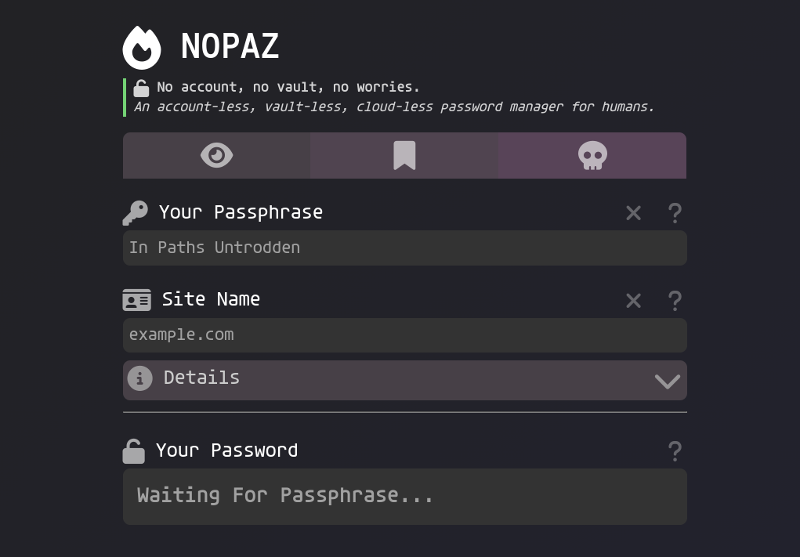

# 🔥 NOPAZ

> No account, no vault, no worries.
> 
> An account-less, vault-less, cloud-less password manager for humans. 



## 💀 Does not feature

- A password vault
- Account management
- Cloud services
- A back-end server
- A database
- A JavaScript framework
- Dependencies on external software
- Leaks
- *Worries*

> [!NOTE]
> NOPAZ deterministically generates "random" passwords based off of your master passphrase and a site id. 
> 
> Configurations are stored as bookmarks which can be kept in your browser or a note taking app.


## 🏞️ Overview
**Purpose:**
The NOPAZ algorithm generates strong, unique passwords for different sites or services using a single master password. It ensures that each password meets customizable complexity requirements (such as character types and length) and can be reproduced exactly given the same inputs. This approach eliminates the need to remember multiple passwords and enhances security by preventing password reuse.

**Functionality:**

1. **Source Construction:**  
   The algorithm starts by constructing a "source" string in the format `<master>:<site>[revision]`, where:
   - `<master>` is the user's master password.
   - `<site>` is a site identifier (e.g., domain or service name).
   - `[revision]` is an optional integer to allow password rotation; zero and negative values are ignored.

2. **Hashing and Encoding:**  
   - The source string is hashed using a cryptographic hash function (SHA-512 or SHA-256).
   - The resulting hash is base64-encoded with custom modifications:
     - If symbols are disallowed, '+' is replaced with '9', '/' with '8', and padding '=' with 'A'.

3. **Password Extraction:**  
   - The encoded hash is truncated to the desired password length.

4. **Iteration and Recursion:**  
   - The algorithm may repeat the hashing process multiple times (controlled by `minIterations`) to increase computational cost.
   - If the password does not meet the required rules (e.g., must contain uppercase, lowercase, numbers, start with a lowercase letter, etc.), the process recurses: the hash becomes the new source, and hashing repeats until all rules are satisfied.

5. **Rule Enforcement:**  
   - Rules are defined per "special mode" (e.g., `all`, `legacy`, `none`) and include requirements for symbols, uppercase, lowercase, numbers, and starting character.
   - The password is checked against these rules after each iteration.

6. **Final Output:**  
   - Once a password satisfies all rules and minimum iterations, it is returned, optionally with an appended string.

> [!NOTE]
> The implementation is largely inspired by and derived from [Eblade/paz](https://github.com/eblade/paz).

## 🍞 Bun
This project is built with `bun` a super fast NodeJS/TSC/NPM/Bundler alternative written in Zig. 

> [!TIP]
> You **do not need Bun to use this app** you only need it for development. 

[Get Bun](https://bun.com/docs/installation)

## 🏠 Hosting

Simply point a static file server at `./dist`. There is no need to build the app.

For example:
```sh
# With bun
bunx serve dist

# With npm
npx serve dist
```

## 🔨 Building

If you want to make changes to the app and need to rebuild the typescript, do:

```sh
bun run build
```

## 🔎 Query Parameters

### ste - Site
- String
- Site identifier
- `example.com` or `my special site`

### spc - Special
- String
- Special rules for password generation
- `all | legacy | none`

### len - Length
- Number
- Password length

### rev - Revision
- Number
- Password revision number

### nts - Notes
- String
- URL encoded notes 
- Can contain multiple lines 

### mit - Minimum Iterations
- Number
- Minimum hashing iterations.

### app - Append
- String
- Append a string to the end of the password
- Increases password length

### alg - Algorithm
- String
- Selected algorithm
- `sha256 | sha512`

### Example
```
.../?ste=asd&spc=all&len=16&rev=1&nts=&mit=10&app=&alg=sha512
```

### Special Parameters
- `dbg=1` : Debug mode
- `adv=1  ` : Advanced mode UI


## 💡 Inspired by
- [Eblade/paz](https://github.com/eblade/paz)
- [Chriszarate/supergenpass](https://github.com/chriszarate/supergenpass)
